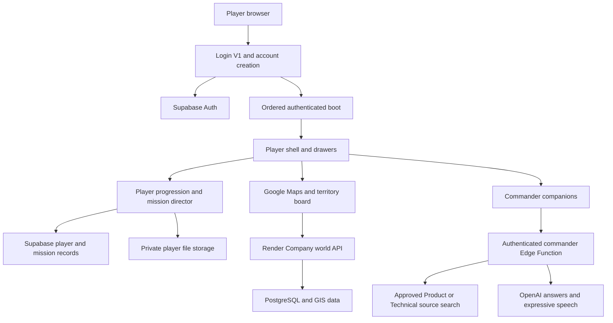

# AgWorld Development Version 2 Project Report

Project structure, implementation record, engineering review and continuation roadmap

Prepared for the AgWorld product owner and future development sessions. This report describes the Development Version 2 implementation and the verification scope for its release, dated 13 September 2026. The release record in `OFFICIAL_BASELINE.md` identifies the published checkpoint. Production accounts, private libraries, storage objects, billing and provider secrets are separate from the source checkpoint.

## 1 Purpose and product direction

AgWorld is the Agriculture build of the wider Game Changer platform. It makes agricultural sales activity visible on a geographic game board. Players learn their role, build product knowledge, scout businesses, develop relationships and grow Company influence. Territory conquest means recorded commercial influence and relationships, not legal ownership of land.

The product combines a map, player progression, business records and six conversational commanders. The System Administrator teaches the system. Compliance, Product, Sales, Operations and Technical correspond to the five skills; the Administrator is a guide rather than a sixth skill.

The current product direction is an immersive map with independently retractable interface drawers. The supplied AgWorld reference image controls the visual language: deep teal surfaces, fine turquoise edges, lime active states, condensed headings, photographic advisor imagery and clear game rewards. The existing screen geometry remains the layout authority.

## 2 Planning references and decisions

The available earlier planning reference is `AG WORLD/ARCHITECTURE_AUDIT.md`, supported by the Agriculture build manifests and the September 10 code audit. It specifies a reusable Game Changer core, separate builds and roles, a single mission repository, central authentication, component ownership and progressive removal of historical patches. The original commercial project plan has not yet been independently identified; its milestones and dates require reconciliation before this roadmap can be described as an exact reproduction of that plan.

The product owner’s subsequent decisions take precedence over earlier screen documents:

- Preserve the current geometry while applying the reference styling across player workspaces.
- Start with SADC and collapsed drawers. Clicking a country selects it and reveals provinces; province and municipality selections control the statistics. Zoom alone preserves the selected statistics.
- Place skills in Profile. Dashboard contains profile, sales funnel, current mission and six advisors.
- Put mission XP and stars in a white rewards panel on the right.
- Use a phased Administrator welcome, followed by Compliance readiness, Product learning and Sales activity.
- Keep completed orientation completed. A returning player does not receive an endless repeated system tour.
- Use expressive generated voices. Dialogue starts closed; microphone and camera capture require explicit actions.
- Use fully real-time 3D for future characters. The current portraits are a temporary accepted presentation, not completed 3D animation.
- Restrict dealer and staff source libraries to explicitly approved Company staff. Exclude signed agreements and customer records from general advisor retrieval.

## 3 Application structure

```text
Repository
  GAME CHANGER/                   Corporate brand and platform material
  AG WORLD/
    index.html                    Current player entry and deferred boot contract
    admin.html                    Agriculture administration interface
    master-admin.html             Legacy platform administration interface
    developer-mode.html           Standalone diagnostics page
    login/v1/                     Account creation, sign-in and session gate
    boot/v1/                      Ordered loading, readiness and regression checks
    core/                         Shared roles, entities, relationships, events and UI
    builds/agriculture/           Agriculture manifests and implementation boundary
      missions/                   Development V2 journey, styles and mission catalogue
    server/                       Render API, SQL deployment sources and commanders
      commanders/index.ts         Supabase Edge Function for chat and speech
    database/                     Database/API contracts and historical schema sources
    knowledge/                    Commander collection policies and source organisation
    data/gis/africa/               Country/province polygons, symbols and attribution
    assets/                       Fonts, mission artwork, advisors and game artwork
    brand/                        Logos, visual system and brand guides
  .github/tests/                  Isolated browser, service and domain tests
  .github/workflows/              Review gates and GitHub Pages deployment
  tools/                         Library import and source-audit tools
  docs/                          Project handover and 3D production requirements
```

Many live Agriculture modules still sit at the application root. They are compatibility modules retained during the migration described by the earlier architecture plan. New mission implementation lives under `builds/agriculture/missions/`. Moving all historical files at once would change dependency paths and increase regression risk.

## 4 Runtime and service architecture



The primary player site is `https://ag-world.onrender.com/AG%20WORLD/index.html`. GitHub Pages publishes another copy at `https://cypresshillbilly.github.io/Agworld/`. The Company world API is `https://ag-world-api.onrender.com`. Supabase project `vcnkspaljmsjvonftfcw` provides authentication, player data, private source retrieval, storage and the `ag-world-commanders` function.

The browser contains a publishable Supabase key. OpenAI credentials belong only in Supabase secrets. The API server’s database connection belongs only in its hosting environment. Neither belongs in this document or a browser bundle.

## 5 Loading and page ownership

`index.html` contains the source sequence. `boot/v1/source-order.json` verifies the same sequence. Only the two Login V1 scripts execute before authentication; game scripts are fetched ahead of time and executed in dependency order after sign-in. The release contains 70 external source entries, including 68 deferred entries. An exact duplicate Command/Territory script entry was removed in Development Version 2.

The loading stages represent authentication, interface, systems, map, world, population and final readiness. The game is revealed only when the required map and player state are ready. Failed scripts, missing styling and failed readiness show recovery controls rather than a partially constructed player screen.

| Surface | Primary implementation | Ownership notes |
|---|---|---|
| Login and account creation | `login/v1/auth.js`, `login-panel.js` | Supabase player authentication and pre-game registration |
| Loading | `index.html`, `boot/v1/performance.js` | One boot promise and ordered source execution |
| Screen geometry | `main-game-layout-v1.js` | Existing outer geometry; historical overrides remain |
| Drawers | `game-view-mode.js`, `game-reference-theme.css` | Player navigation and workspace, Map Menu, Territory Stats, Command Center |
| Player workspaces | `player-menu-panels.js` | Dashboard, Profile, Sales Funnel and other menu routes |
| Dashboard mission | `agworld-player-progression-stack-v1.js` | Current saved mission and white reward panel |
| Player progression | `player-progression-v27.js` | Authenticated state, current mission and persisted completion |
| Mission experiences | `builds/agriculture/missions/player-journey-v2.js` | One route into the V2 curriculum, tasks, evidence and private uploads |
| Territory selection | `territory-board-v1.js` | Geographic hierarchy, country isolation, symbols and selected statistics |
| Entity map/editor | `app-gis-loader-v24.js` | Farm and business selection, creation and editing |
| Sales activity | `player-sales-dashboard.js` | Player-owned activity, relationships and recorded meeting outcome |
| Advisors and audio | `commander-companions.js`, `system-administrator-guide.js` | Persona, dialogue, audio lifecycle and explicit microphone actions |
| Source library | `advisor-knowledge.js`, commander Edge Function | Approved collection search and citations |
| Developer diagnostics | `developer-mode.js`, `developer-diagnostics.js` | Component state, errors and request outcomes |

Legacy standalone administrator pages are part of the repository checkpoint. Their older client-side administration login is not a trusted authorization boundary and still needs migration before unrestricted production administration. Player authentication and the new private file/library paths use separate verified controls.

## 6 Geography and the game board

The opening territory is SADC, with 16 member countries in focus. The wider available Africa dataset contains 48 country records. Country symbols and provincial symbols are stylised vector graphics, not rigged real-time 3D models. Country and South African province clicks select an area and move toward the next geographic level.

The progression levels used by the map are country, province, municipality, town and farm. Farms and contractors share the farm-detail visibility threshold, around zoom 13. The map menu can enable or disable boundaries, symbols, market influence, businesses, relationships and farm assets. A layer must be both enabled and appropriate to the current zoom before it appears.

Territory colour and Company influence use recorded farms, contractors, drone quantities, relationships and statuses. Neutral, competitor and Company records participate in the market model. The percentage is neither a complete agricultural census nor a percentage of land legally owned. The selected area persists when zooming alone changes display detail.

Elevation Relief uses shaded terrain as a display option. It is not a custom high-resolution terrain mesh. Boundary attribution remains accessible through the Map Menu.

## 7 Player journey and mission persistence

The V2 curriculum is ordered by completion, independently from XP level. This prevents an XP threshold from skipping unfinished training. Existing mission identifiers, completion history and player XP are retained. Earlier completed checklist missions are not retroactively certified as new document uploads or newly assessed competencies.

### Administrator orientation

The introduction covers ten saved phases: welcome and purpose; the supporting commanders; Player Hub and Dashboard; mission completion; Map Menu; South Africa; a province; a municipality and Territory Stats; farm-detail zoom and farm inspection; and handover to Compliance. Map stages require the matching selection/action. The player can minimise the task while using the map and resume from the saved phase.

The commander speaks with dialogue closed. Completed or already-heard introductions stay quiet on later arrivals. A new current mission is briefed by its owning commander. Players can deliberately ask questions or replay a tour.

### Compliance readiness

The player saves profile information, uploads required documents privately, passes a three-question safety assessment and takes or uploads a profile photograph. A webcam permission result arriving after the task is closed is discarded and its tracks stopped. Selecting a file does not certify its contents. Document completion means submission and the player’s acknowledgement of required categories, not human approval or verified identity.

The safety content is introductory Company field conduct. It does not replace a regulated operational qualification, equipment-specific procedure or employer-approved safety programme.

### Product learning

Product training requires approved library membership. It loads a selected model’s source passages into a presentation, displays manufacturer product photography where mapped, and links the official presentation. Initial image mappings cover T50 and T100; other catalogue models retain source-based lessons. The player writes a supported benefit and limitation, progresses to application learning, and compares two models while asking the Product Commander a question.

Source identifiers are saved as learning evidence. Private source passages are not duplicated into mission progress. Reflection completion is self-attested; it is not an independently graded product examination. Future work should add curated model-specific decks and question banks with reviewed correct answers.

### Sales activity

Sales starts with existing recorded prospects when present and scouting when the map has no records. Tasks cover working-area selection, farm inspection, farm creation or updates, relationship classification, contractor and competitor records, a planned drone meeting and its actual outcome. Record creation tasks wait for the application’s successful-save events. Meeting plans and outcomes are explicit records and do not automatically create a sale or revenue figure.

Neutral and competitor prospects are the target of the first drone meeting. “Enemy” is treated as competitor-aligned business in the current data model. Company clients are shown as Company relationships. Technical remains available on demand and is not a required sales training stage.

### Atomic completion

`ag_complete_mission_v2` runs with the caller’s privileges and a fixed search path. It locks the player row, checks the current prerequisite and saved readiness, records completion, updates XP/level, and writes career/contribution records in one transaction. A repeated completion returns the existing result without another reward. Player state reloads from the database after confirmation.

Mission evidence is user-originated game data. This release does not provide server-side anti-cheat attestation of every map action or independently verify real-world meetings. A future audited competency/commission system requires stronger server validation and human review.

## 8 Data and privacy model

| Record | Purpose | Access boundary |
|---|---|---|
| `ag_players` | Name, XP, level, chapter, career and Company facility | Player ownership policies |
| `ag_mission_progress` | Mission status, partial steps and evidence in `mission_state` | Own player only |
| `ag_career_events` | Saved career events | Own player policies |
| `ag_contributions` | Mission/Company contribution history | Existing contribution policies |
| `ag_farm_events` | Player-attributed changes to the shared farm world | Shared farm event workflow |
| `farms`, `farm_objects`, `farm_crops` | Geographic and business records | Render world API and existing database policies |
| `contractors`, `competitors`, `company_facilities` | Business entities | Existing authenticated entity workflow |
| `entity_relationships` | Connections between businesses/entities | Enrolled-player read; direct writes require creator ownership |
| `farm_audit_readable` | Audit display | Invoker permissions and underlying row policies |
| `ag_knowledge_members` | Administrator-approved library collections | Own membership read, administrator-managed writes |
| `ag_knowledge_documents`, `ag_knowledge_chunks` | Source catalogue and searchable excerpts | Approved collection membership |
| `storage.objects` in `agworld-player-private` | Compliance documents and profile photos | Private bucket, authenticated user folder ownership |

The private player bucket accepts PDF, JPEG, PNG and WebP files up to 10 MB. Photo tasks accept image formats. Paths begin with the authenticated player ID and use generated file identifiers. Profile display uses expiring signed URLs. The existing public artwork bucket is not used for these files.

The Product/Technical collections are separated by source purpose and model. Import tooling excludes signed agreements and customer records from ordinary advisor answers. Dealer-only access cannot be granted by editing a player’s display role or registration metadata.

## 9 Conversational commanders

The commander service validates the bearer token on every POST. Product and Technical requests also check the caller’s approved collection and retrieve sources using that caller’s token. The exact Render and GitHub Pages origins are permitted. Credentials stay server-side.

| Commander | Generated voice | Responsibility |
|---|---|---|
| System Administrator | cedar | Welcome, system orientation and panel guidance |
| Compliance | coral | Profile readiness, documents and introductory conduct |
| Product | marin | Source-grounded product learning and questions |
| Sales | ash | Scouting, client relationships and sales missions |
| Operations | verse | Field organisation and operational guidance |
| Technical | onyx | Approved technical/after-sales sources on demand |

The voices are AI-generated character voices, not recordings or replicas of named real individuals. Chat uses the Responses API; speech uses generated MP3 audio. The current model defaults are `gpt-5-mini`, `gpt-4o-mini-tts` and `gpt-4o-mini-transcribe` where applicable. Chat requests set `store:false`; provider handling still follows the connected account’s policies.

The portrait toggles dialogue without restarting speech. Pause, resume, stop and autoplay recovery are separate controls. A failed generation presents an actionable retry state. The microphone begins only after Ask by voice; camera capture belongs to the profile task. Private compliance files and profile-photo bytes are never supplied to the commander service.

## 10 Engineering review

The review combines a repository-wide line scan, classic-JavaScript parsing, explicit dependency verification, manual review of active data/auth/mission paths, and browser exercises. The scan covers text source, configuration, documentation and data files; line counts must not be mistaken for independently reviewed executable-code lines.

`tools/audit-development-v2.mjs` produces a file inventory with path, size, line count and SHA-256, plus review candidates for storage writes, global overrides, timers, observers, HTML writes and client credential verifiers. The accompanying source inventory is part of the handover evidence. Static matches are review candidates, not automatically vulnerabilities.

Resolved findings in this release include:

- Repeated mission awards were moved to one idempotent database transaction.
- Chapters no longer skip unfinished missions when XP crosses a level threshold.
- Personal file capture uses private owned storage and explicit capture actions.
- The compact reward layout now uses the established theme cascade layer and passes no-scroll checks.
- An exact duplicate Command/Territory runtime script was removed.
- An inactive relationship overlay file contained a malformed expression; its syntax was repaired.
- The shared profile query now uses `current_chapter`, matching the deployed schema.
- API mutations now verify a signed-in, enrolled player and replace untrusted audit identity headers with the verified player ID.
- The production relationship acceptance-test endpoint is disabled.
- Relationship RLS and audit-view invoker permissions address the two error-level database security findings.

The source still contains a large historical presentation stack, whole-document observers, repeating timers and a legacy global fetch/storage bridge. These are significant maintenance and performance-refactoring targets. Removing them without ownership migration would risk changing current behaviour. The browser checks establish tested behaviour at their selected sizes and paths; they cannot establish perfect rendering on every device or prove the absence of all defects.

The farm write review also corrected invalid-payload handling before database connection, rollback on a missing farm update, and recoverable database-connection errors. These paths have focused regression tests.

## 11 Verification and limits

Automated browser checks cover new and returning sign-in, registration/confirmation/retry, staged loading, missing-source/style recovery, refresh/logout, all player menu routes, drawer combinations, geographic selection and zoom rules, market colours, mission rendering, advisor selection and speech controls, library access, webcam cancellation, private uploads and failed-completion retry.

The compact player card is inspected at 1280 × 720 and 1600 × 1000. The broader reference test also exercises 1280 × 900. Screenshots confirm the white reward panel, complete safety copy and preserved geometry. The test map is synthetic and does not validate the availability or visual quality of live Google satellite tiles.

Domain/service tests cover Company control, player-owned sales activity, commander CORS/authentication/source isolation, directed voices, API authorization, mission catalogue consistency and boot sequencing. The database transaction test checks prerequisites, required readiness, one-time rewards, player isolation and private folder ownership; all synthetic database fixtures are rolled back.

Production player records are not reset or used as test fixtures. The user previously confirmed live Administrator audio after the Render-origin fix. New voice content reuses that service; automated audio tests use a controlled response rather than charging the user for repeated generated briefings.

Remaining reviewed limitations:

- Legacy master administration still needs a trusted role/permission migration before unrestricted production administration.
- Product lessons are source presentations and learner reflections, with initial T50/T100 photo coverage, not a complete reviewed product-certification course.
- Compliance submission has no staffed approval queue yet. Document types and retention periods need Company policy decisions.
- Sales missions provide the first persisted scouting-to-meeting sequence. A recurring assignment engine, quotation/order integration and independently verified sales outcomes remain future work.
- Real-time 3D models, walking, footsteps, lip synchronisation and five exits remain asset-production work.
- Leaked-password protection remains a provider configuration warning. Three legacy tables have RLS with no direct-browser policies; this is deny-by-default, and API access uses its own server path.

Database warning references: [password protection](https://supabase.com/docs/guides/auth/password-security#password-strength-and-leaked-password-protection) and [RLS without policies](https://supabase.com/docs/guides/database/database-linter?lint=0008_rls_enabled_no_policy).

## 12 Deployment and restoration

Review work on a feature branch. Verify boot/source order, relevant domain tests and the isolated browser suite before merging. GitHub Pages runs its regression workflow before publishing. Render follows the configured repository deployment. After publishing, compare the live changed files to the reviewed source and check health, allowed-origin preflight and unauthenticated request denial.

The V2 database sources are `server/development-v2.sql` and `server/development-v2-access.sql`. They describe deployed migrations, not browser-executable code. Do not rerun policy-creation scripts blindly against an already migrated project. New database work should use a new reviewed migration and an explicit rollback plan.

The final `baseline/development-v2` branch is a source restoration checkpoint. Restoring it does not rewind the database, private storage, approved memberships, billing, secrets or provider configuration. Restore a commander function from its reviewed source separately, preserving caller authentication and origin restrictions.

The earlier checkpoint `baseline/official-2026-09-12` preserves the last accepted pre-V2 source at `e3b90b0d0c68f9625bf4576477db5ab9fc1b1b0e`. Keep it intact.

## 13 Roadmap

| Priority | Workstream | Delivery condition |
|---|---|---|
| Current | Development V2 journey and visual checkpoint | Reviewed source, database checks, browser checks and live deployment verification recorded |
| Next | Reconcile the original project plan | Identify the original plan; map each requirement to delivered, changed, deferred or cancelled work |
| Next | Trusted administration | Server-verified roles, protected admin actions, permission tests and migration for existing administrators |
| Next | Product academy | Curated decks/images for each sold model, approved benefits/tradeoffs, reviewed assessments and versioned sources |
| Next | Compliance operations | Required-document rules by role, secure review queue, retention/deletion policy and review status |
| Next | Sales mission engine | Recurring location-aware scouting, assigned prospects, meetings, follow-ups, quotations and verified sales outcomes |
| Next | Real-time commander production | Approved likenesses, rigged models, animation clips, voices, performance budgets and browser acceptance tests |
| Parallel foundation | Component migration | Move one verified UI owner at a time behind Agriculture manifests and remove the corresponding historical overrides |
| Parallel foundation | Persistence consolidation | Replace global fetch/Storage interception and obsolete mission handlers with explicit repositories/events |
| Later | Platform expansion | Implement a second build without importing Agriculture-specific assets or rules into Game Changer core |
| Later | Production operations | Custom domain, release environments, rollback rehearsal, monitoring, backups and production access review |

No dates or commercial commitments are assigned where the original plan has not been reconciled. Technical remains on demand for the current salesman experience; a technical training curriculum is a separate future decision.

## 14 Continuation memory

Start future sessions by reading this report, `OFFICIAL_BASELINE.md`, the current source-order manifest, the relevant component source and recent deployment records. Preserve the reference styling and outer screen geometry. A layout change belongs in its component owner; avoid another global override layer.

Preserve player XP and completed mission IDs. Use the authenticated player record as the authority. Never substitute Company totals for player-owned activity. Keep onboarding phased and quiet after completion, and let the mission owner brief its mission.

Keep private compliance files out of artwork storage and advisor retrieval. Keep staff source approval separate from editable profile fields. Never request an API key in chat or put one in a public file. Do not represent portraits, SVG symbols or documented 3D requirements as completed animated models.

Finish a change by checking the paths it affects, inspecting relevant screenshots, publishing the reviewed source and recording the actual deployment result. Report known limitations plainly instead of declaring universal correctness.

## Appendix A — Mission catalogue

This is the ordered source catalogue. XP is awarded once by the completion transaction; level does not skip an unfinished prerequisite.

| Chapter | Mission identifier / title | Commander | XP |
|---|---|---|---|
| 1 | `c1-welcome` — Welcome to AgWorld | System Administrator | 120 |
| 1 | `c1-hr` — Check Your Player Information | Compliance | 180 |
| 1 | `c1-documents` — Submit Required Documents | Compliance | 160 |
| 1 | `c1-safety` — Complete Mandatory Safety Training | Compliance | 200 |
| 1 | `c2-profile` — Create Your Profile Photograph | Compliance | 250 |
| 2 | `c1-company-training` — Meet Your Product Range | Product | 220 |
| 2 | `c2-assets` — Match the Product to the Farm | Product | 300 |
| 2 | `c2-product-compare` — Build a Confident Product Pitch | Product | 250 |
| 3 | `c1-briefing` — Your Sales Territory Briefing | Sales | 120 |
| 3 | `c2-explore` — Scout Your Working Area | Sales | 300 |
| 3 | `c2-survey` — Inspect a Farm Prospect | Sales | 350 |
| 3 | `c2-create` — Record Your Farm Intelligence | Sales | 400 |
| 3 | `c2-intelligence` — Classify Your Prospect | Sales | 350 |
| 3 | `c3-contractors` — Scout a Contractor | Sales | 300 |
| 3 | `c3-competitors` — Scout a Competitor | Sales | 300 |
| 3 | `c3-meeting` — Plan a Drone Meeting | Sales | 400 |
| 3 | `c3-follow-up` — Record the Client Outcome | Sales | 450 |

## Appendix B — Active source order

The following 70 entries are verified against the HTML boot sequence. Login V1 executes before authentication; all other entries are deferred. Query-version strings are omitted here and retained in the source-order manifest. CSS, inline boot code and assets are listed by the companion source inventory rather than this script-only sequence.

| Order | Runtime source |
|---|---|
| 1 | `boot/v1/three.mjs` |
| 2 | `core/role-config.js` |
| 3 | `core/bootstrap.js` |
| 4 | `builds/agriculture/profile/profile.manifest.js` |
| 5 | `builds/agriculture/profile/profile.module.js` |
| 6 | `api-bridge.js` |
| 7 | `config-gis-v4.js` |
| 8 | `world-data-mode-v1.js` |
| 9 | `territory-board-v1.js` |
| 10 | `app-gis-loader-v24.js` |
| 11 | `contractor-gis-control-refresh-v1.js` |
| 12 | `demo-world-seed-v1.js` |
| 13 | `farm-visual-engine.js` |
| 14 | `farm-zoom-visual.js` |
| 15 | `game-hud.js` |
| 16 | `game-view-mode.js` |
| 17 | `system-administrator-guide.js` |
| 18 | `mission-history-premium-v1.js` |
| 19 | `unified-panel-polish-v1.js` |
| 20 | `agworld-final-brand-unification-v1.js` |
| 21 | `agworld-command-territory-surface-v2.js` |
| 22 | `menu-map-navigation.js` |
| 23 | `login/v1/login-panel.js` |
| 24 | `login/v1/auth.js` |
| 25 | `user-profile-modal.js` |
| 26 | `skill-tree.js` |
| 27 | `game-map-filters-v2.js` |
| 28 | `menu-settings-logout.js` |
| 29 | `territory-missions-v26.js` |
| 30 | `player-progression-v27.js` |
| 31 | `interactive-onboarding-v28.js` |
| 32 | `interactive-field-learning-v29.js` |
| 33 | `precise-chapter2-v30.js` |
| 34 | `stateful-chapter2-v31.js` |
| 35 | `chapter2-director-career-v32.js` |
| 36 | `chapter3-campaign-v33.js` |
| 37 | `chapter3-verification-v34.js` |
| 38 | `territory-control-unified-v1.js` |
| 39 | `core/entities/entity.schema.js` |
| 40 | `core/entities/entity-types.js` |
| 41 | `core/entities/entity.repository.js` |
| 42 | `core/entities/entity.service.js` |
| 43 | `core/entities/farm.entity.js` |
| 44 | `core/relationships/relationship.schema.js` |
| 45 | `core/relationships/relationship.repository.js` |
| 46 | `core/relationships/entity-interaction-engine-v1.js` |
| 47 | `core/events/world-event-consequence-engine-v1.js` |
| 48 | `world-events-management-v1.js` |
| 49 | `core/ui/entity-detail-panel-v2.js` |
| 50 | `core/ui/farm-detail-panel-v2.js` |
| 51 | `relationship-network-canonical-v2.js` |
| 52 | `shared-backend-v37.js` |
| 53 | `shared-farm-world-v38.js` |
| 54 | `login/v1/gate.js` |
| 55 | `main-game-layout-v1.js` |
| 56 | `agworld-command-territory-final-v3.js` |
| 57 | `agworld-player-surface-final-v1.js` |
| 58 | `agworld-landing-game-layer-v1.js` |
| 59 | `agworld-final-layer-cleanup-v2.js` |
| 60 | `profile-menu-refinement.js` |
| 61 | `player-sales-dashboard.js` |
| 62 | `agworld-player-progression-stack-v1.js` |
| 63 | `agworld-mission-control-card-polish-v1.js` |
| 64 | `player-menu-panels.js` |
| 65 | `branded-sidebar.js` |
| 66 | `game-reference-theme.js` |
| 67 | `game-exploration-tools.js` |
| 68 | `advisor-knowledge.js` |
| 69 | `commander-companions.js` |
| 70 | `builds/agriculture/missions/player-journey-v2.js` |

## Appendix C — API and integration contract

All `/api` writes require a verified enrolled player; private `/users` reads are restricted to the verified user. Shared world GET routes remain public in this development baseline. The historical acceptance-test endpoint returns 404 in production.

| API family | Purpose |
|---|---|
| `GET /api/health` | Database availability without credentials or data payloads |
| `GET /api/farms`, `GET /api/farms/:id` | Shared farm geometry, business detail, objects and crops |
| `POST /api/farms`, `PATCH /api/farms/:id` | Save a farm and its audit record |
| `POST /api/farms/:id/objects` | Add a farm asset; atomic object/audit consolidation remains follow-up work |
| `/api/v2/relationships` | Entity-to-entity relationship lifecycle through the registered route module |
| `/api/users/:id/profile`, `/api/users/:id/leaderboard` | Legacy user profile/territory adapters; authenticated player ownership applies |
| Supabase `ag_complete_mission_v2` RPC | Ordered, idempotent mission award |
| Supabase `ag_knowledge_catalog` and search RPC | Approved source catalogue and retrieval |
| `ag-world-commanders` POST | Authenticated chat and character speech; staff-source access where required |

The profile experience primarily reads `ag_players`; the Render `/users` routes remain legacy adapters and must not become a second XP authority. Browser compatibility interception exists in `api-bridge.js`; token forwarding is restricted to the configured API origin. Prefer explicit API clients for future components.

## Appendix D — Reproduction and handover checklist

1. Read this report and `OFFICIAL_BASELINE.md`; inspect the V2 checkpoint before changing files.
2. Use Node 22 or a compatible current runtime. Run the boot verifier and the test commands in `.github/workflows/agworld-v1-boot-regression.yml`. The isolated browser fixture needs Playwright and Chromium/Edge.
3. Test new and returning users without modifying real player data. Run the database assertions inside their rollback transaction only.
4. Check the changed component at the recorded viewport sizes and test its error/cancellation paths.
5. Publish through a reviewed branch. Wait for regression/deployment jobs, verify both live frontends and the API, and record the exact source revision.
6. Apply database changes as new migrations and deploy commander source separately when changed. Keep secrets in the provider console.
7. Update this document when behaviour, contracts or roadmap decisions change. Preserve the prior checkpoint.

The companion machine-readable source inventory records each inspected text file, size, line count, SHA-256, static review candidates and classic-script parse results. It is an audit index, not a replacement for the code repository. Binary assets, private source libraries and deployment secrets are deliberately outside that text-line inventory.
